# include.ai Notebook Documentation
Welcome to include!

The [include.ai](http://include.ai/) Notebook is an interactive Notebook used to build internal tools that read like documents.

<div class="md-video">
	<iframe src="https://player.vimeo.com/video/476520561?loop=1&autoplay=1&controls=0&sidedock=0&title=0&muted=1" frameborder="0" allow="autoplay; fullscreen" allowfullscreen></iframe>
</div>

<style type='text/css'>
.md-video {
	margin: 0 auto;
	position: relative;
	padding-top: 80.5%;
	border-radius: 5px;
	box-shadow: 0 4px 4px 0 #424242a4;
}
.md-video > iframe {
	border-radius: 5px;
	width: 100%;
	height: 100%;
	position: absolute;
	top: 0;
	left: 0;
	border: 0;
}
</style>

### What is a Notebook?
Here's a quick mental model: you can think of the include.ai Notebook as the "micro-service architecture" take on internal tools. **Each Notebook accomplishes a single task** (remove/add a user, change a feature flag, upload a CSV to a user's demo account)**.** Because each Notebook solves only one task, it is faster to develop and easier to use, maintain, and share than apps built with traditional UI app builders.

Developing in include.ai is similar to the iterative and interactive development in Jupyter notebooks. Each Block in an include.ai Notebook runs independently and returned data is accessible in later blocks. Similar to other Notebooks, you can do cool things like calling a slow API once to grab user data and then run multiple code blocks to clean/process the data without rerunning the API.

In addition to the basic text and code Blocks, the include.ai Notebook also includes user-interaction Blocks (input, dropdown, CSV upload) and visualization Blocks (template string replacing in Markdown, Table). More Blocks are being added every day (let us know what blocks you want)! For more documentation on Blocks, see the Blocks section.

All of our features are focused on reducing the friction to build and use Notebooks. Try it for yourself; you can create and publish a new Notebook in less time than it takes to decide on a front-end framework to use.

### What is it good for? 

The include.ai Notebook excels at self-contained tasks that "do something." These tasks usually take user input (text input, dropdown, uploading a file), call product APIs, run SQL queries, or run Javascript. The main use case is writing code to get users (sales, marketing, recruiting tools).

### What is it not good for? (When should you not use include.ai?)

include.ai Notebooks are not ideal for complex internal tools that resemble a database (check out Airtable or Retool) or for highly interactive data science apps (check out StreamLit). If you are writing an interactive essay with a focus on visualization, check out Observable. If you do not need to publish your Notebook as an app, stick with Jupyter or Google Colab.

# Notebook Basics

### Blocks

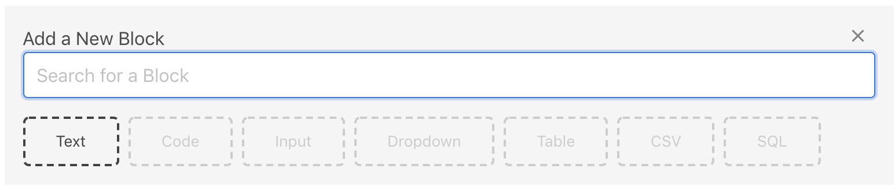

Each include.ai Notebook is made up of a linear series of "Blocks." They are the atomic unit of the include.ai Notebook ecosystem. There are a few different types of blocks:

**Display Blocks** display well-formatted data such as text and tables:
   
* Text Block
* Table Block

**Interaction Blocks** allows users of the notebook to input data or control certain variables:

* Input Block
* CSV Block
* Dropdown Block

**Command Blocks** are used to execute certain functions like custom-defined javascript, API calls, or even SQL queries:
* Code Block
* SQL Block

Check out the Block Reference section and Block Basics for the full documentation.


### Publishing Notebooks into Mini-apps
One key feature of an include.ai Notebook is in "publishing." Upon publishing, the Notebook automatically hides away a lot of the complexity, such as raw javascript code and SQL instructions. The notebook becomes a simple-to-read, self-explanatory mini-app that anyone can use.

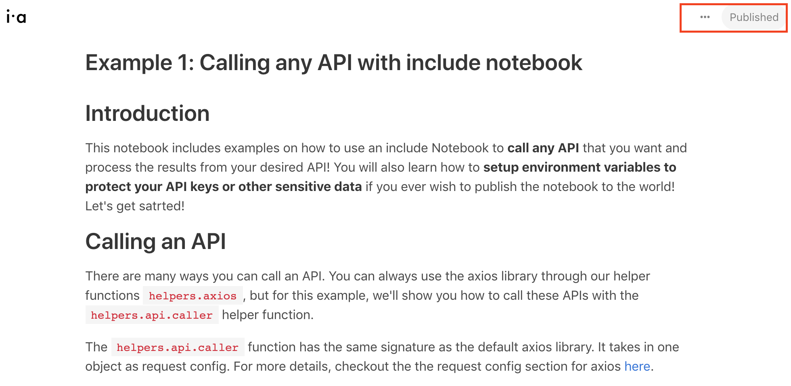


# Workspaces, Sharing, and Publishing to the World

### Why Workspaces?

Notebooks shine in a collaborative work environment: when you're making a notebook for a team member or what to use a notebook created by your team.

Workspaces are how you organize notebooks. With workspaces, you have fine-grained control over not only who gets to see your notebooks but also who can make edits and publish them.

Everyone starts with a personal workspace that is private. You can always create new workspaces.

To invite a colleague to a workspace, click on the three dots next to the workspace name.

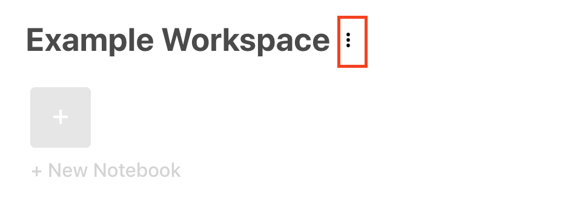

And then type in your collaborator's email and the corresponding permission you want to assign to them.

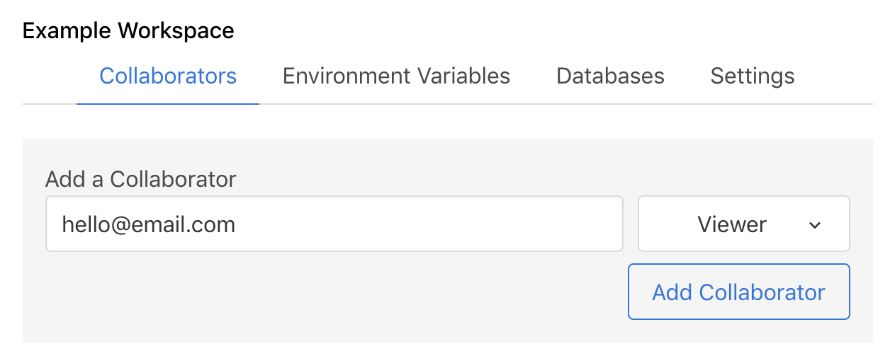

### Access Control through Workspaces

There are three levels of permission for each workspace: Owner, Editor, and Viewer.

* **Owner**: the creator of the workspace and automatically have access to edit the notebooks
* **Editor**: can also edit the notebook and use published notebooks
* **Viewer**: can only use published notebooks within a workspace.

Differentiated access privilege across different workspaces allow you to securely deliver what the Notebook needs to accomplish by only exposing parts of your larger tooling environment.

### Configuring Resources and Environment Variables for Workspaces

Each Workspace also comes with configurable environment variables and database connections. These environment variables can include sensitive data like API keys or common configuration setups repeated across notebooks. Database connections are integrations into your systems like your Postgres database.

Configure these variables and resources by first clicking on the three dots next to the workspace name. And then navigate to the "Environment Variables" or "Database" tab.

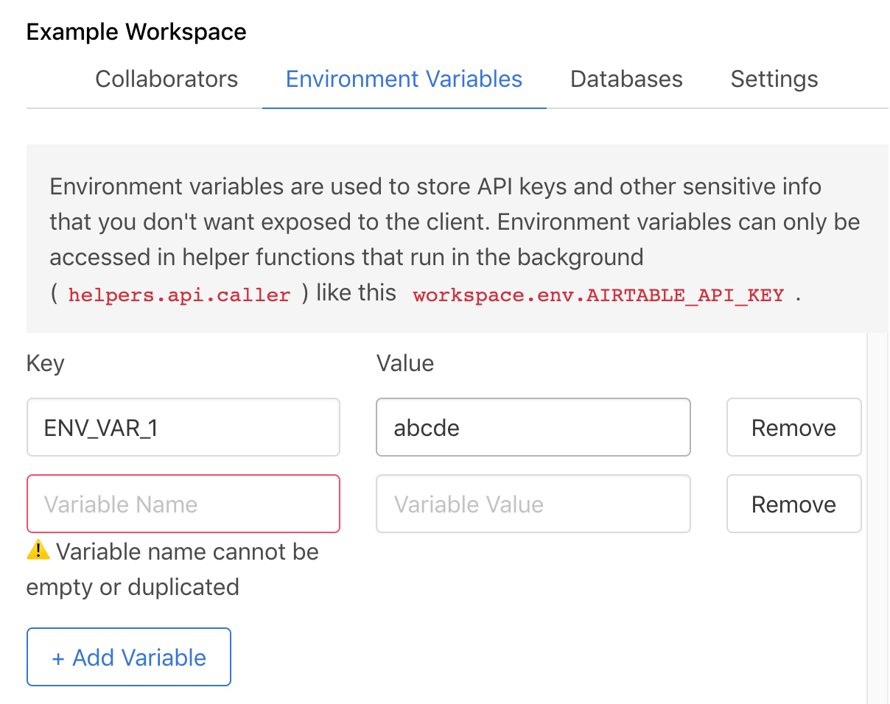

### Publish your Notebook to the World

Sometimes, you may want more than just your team to see your work. With include.ai Notebook, you can quickly publish your notebook to the rest of the world. So anyone with a shared link can visit use your published notebook.

To publish your notebook, click on the top right corner of a Notebook and then click on "Share with the world."

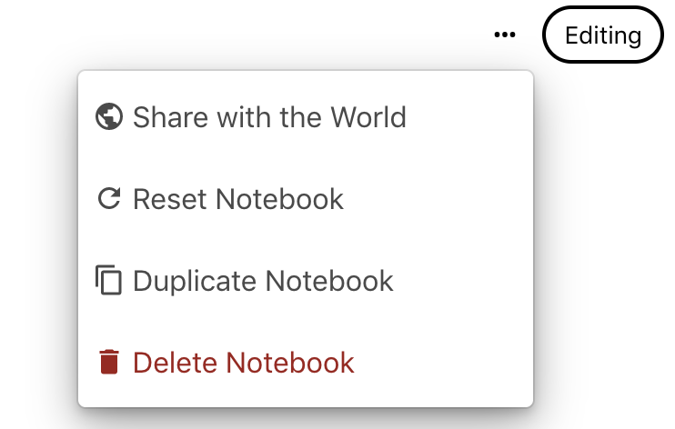

One security tip: making your notebook public potentially exposes all of your code to the open world. Make sure you don't include any sensitive information like API keys in your notebook. Instead, use environment variables in API calls to protect your keys.

# Block Reference

## Block Basics

### Variables and Data Flow

Throughout include.ai Notebooks, you'll have access to globally scope "variables." These variables can be used as inputs into code blocks or displayed texts. 

There are two main ways of changing the values of a variable:
* Use an interaction block like Input Block or Dropdown block to manually update variable values.
* Or use a Code Block: the code block return value should be an object, and each key in the object will create or update variables with the corresponding name.

Note that in each block, you can only access variables created before the said block.

### Block Reactivity

Data in every block updates in real-time. The display blocks will always show the most up to date data even when you run command blocks separately.
The only exception is that code blocks would not automatically rerun when variables updates.

### Conditionally Render Blocks

You can also control when blocks are displayed. All blocks can be hidden or displayed by writing a simple boolean function. This is useful when you only want to expose certain portions of functionality when criteria are met.

You'll still be able to edit any hidden blocks in the editor's view. The blocks will only be conditionally hidden only when a notebook becomes published.

Simply click on the eye icon next to any block. You'll see an edit field to write a boolean function. You'll have access to all the variables as well.


## Text Block

Text blocks are the bread and butter of an include Notebook. It supports all the standard markdown format like **bolding**, *italicizing*, bullet points, code snippets, and more.

Text blocks can also utilize any variables created in any previous blocks. You can easily access their values with double brackets around the variable names like {{variable name}}


## Table Block

Table blocks are used to display any tabular data structures. It's perfect for visualizing data pulled from your database or uploaded through CSV. The required data structure to display is in the format of an array of JSON objects

Tables update automatically when the underlying data changes so the data you see is always live!

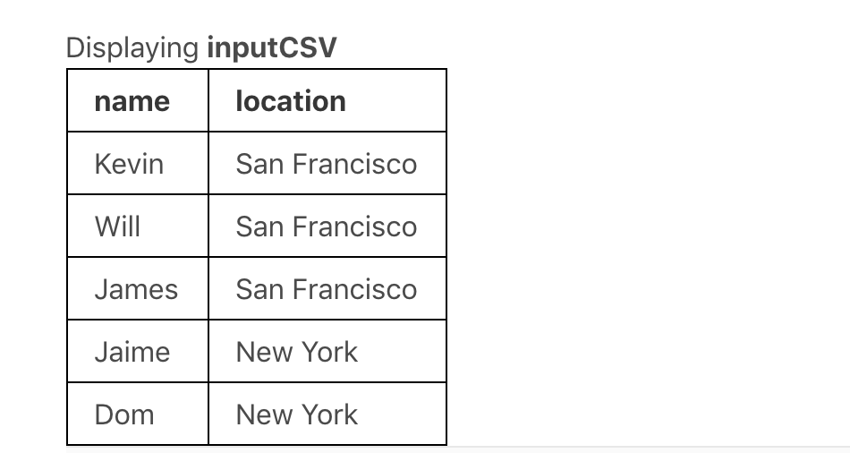

## Input Block

An input block allows a user to configure a specific variable. include.ai Notebook allows you to associate such a variable with an input element to be used anywhere later in the notebook, such as a text block or code block as inputs.

The display name for input blocks can contain spaces. An access name of these variables will automatically be converted to camel case. For example, if you have a variable name to be `Search Query`, you'll be able to use this variable later through `args.searchQuery`. You should also see a preview of the variable underneath the input element.

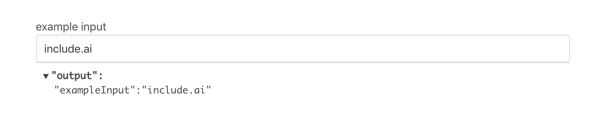

## Dropdown Block

For some use cases, you don't necessarily want to give your user 100% creative freedom to put anything in the inputs. Dropdown blocks help you control the range of inputs for a variable.

You can either specify all the choices in the dropdown block itself

...or have the dropdown block pick values from another variable so long as the variable is an Array

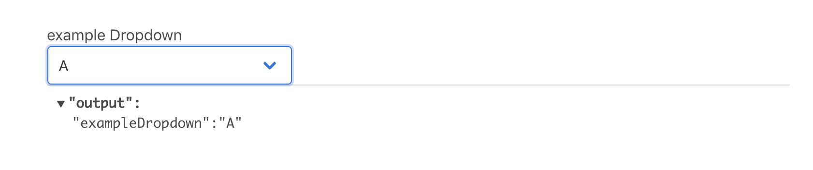


## CSV Block
CSV blocks allow your users to upload .csv files into the notebook as a variable directly. The first row of the CSV will be interpreted as the column names. The resulting variable will be an array of JSON objects, with each item being a row from the .csv file.

CSV blocks also result in new variables that can be accessed in any subsequent blocks

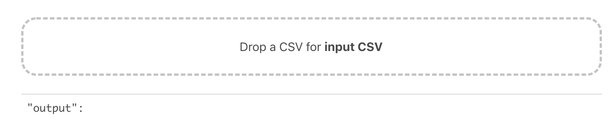

## SQL Block

SQL block can directly integrate with your databases and directly pull data into your notebook. You can write SQL directly in the notebook and it will be securely executed to by our server in the backend. Here is an example usage

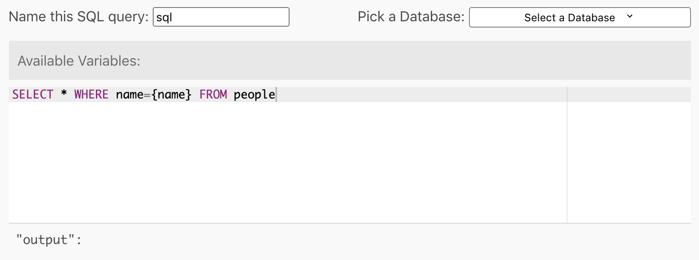

To setup the database connection, you have to setup the desired database as resources in the workspace. Navigate to the resource tab in workspace settings 

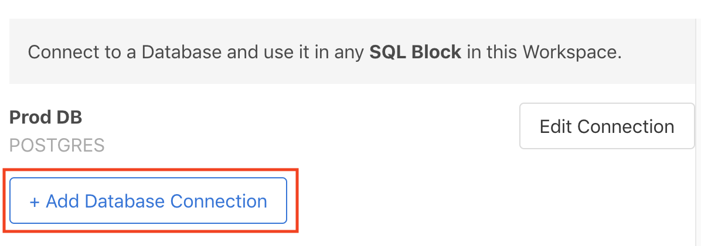

...and you should be able to add a database connection!

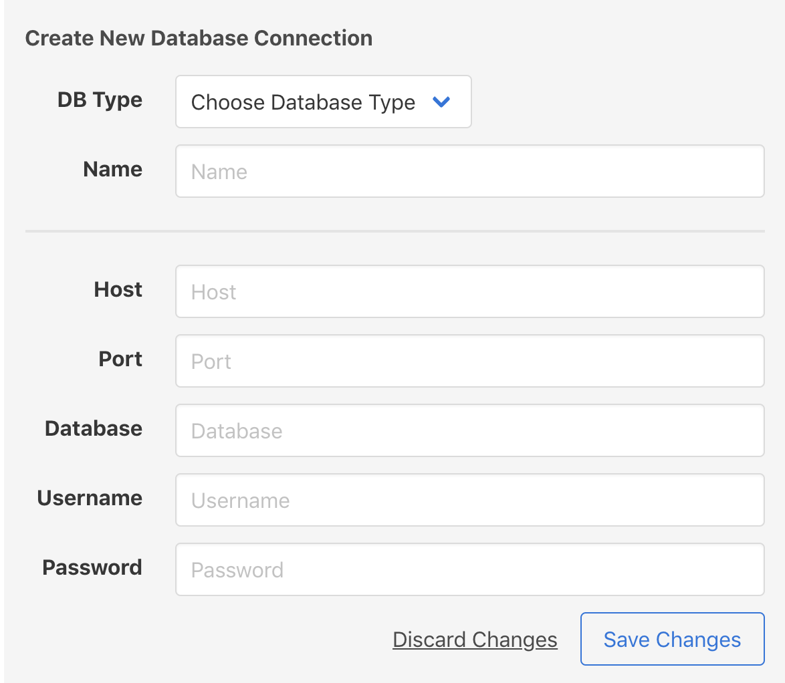


## Code Block

Code blocks give developers the ability to create arbitrarily complex functionality wrapped under one button.

In particular, each code block should be an async javascript function with 3 inputs: `args`, `helpers`, `workspace`. Note that the output of a block needs to be an object. Each key of the return object will be interpreted as variables that will become accessible in all subsequent blocks. An example code block can look like the following

```
async function(args, helpers, workspace) {
	return {
		hello: "world"
	};
}
```

We'll go through each of the inputs in a little more detail below.

### `args`: accessing variables in code blocks

development. A full list includes:
* `helper.wait`
* `helper.getEmailFromText`
* `helper.axios`
* `helper.Airtable`
* `helper.api`

#### `helper.wait(ms: Number)`
This function waits for a set amount of milliseconds. Sample usage:

```
// this will block execution for 3000 miliseconds
await helpers.await(3000);
```

#### `helpers.getEmailFromText(text: String)`
This function parses out the first email address in an input string. Sample usage:

```
const email = helpers.getEmailFromText("reach us at founders@include.ai");
// email will be "founders@include.ai"
```

#### `helpers.axios`
This is a thin wrap around the standard Axios library (reference [here](https://github.com/axios/axios)). You can simply use this library like how you use the Axios library. Sample usage:

```
const resp = await helpers.axios({
	method: "GET",
	url: "https://api.covid19api.com/summary"
});
```

#### `helpers.sql`
This is a library that you can write SQL to be executed in memory. It's a wrapper around the open-source project [alasql](https://github.com/agershun/alasql). You're required to add in data into alasql first before writing queries.

Note that with any data imported from a CSV block, they are automatically added as a table into alasql. Sample usage:

```
const peopleInLocation = helpers.sql(`
		SELECT location, COUNT(name) as PeopleInLocation FROM input GROUP BY location
`);
```

#### `helpers.api`
`helpers.api` is a somewhat special package meant to be used to call any API. This package deserves a more lengthy discussion that you can check it out here: in the "Using `helpers.api` package" section below

### Using `helpers.api` package

#### Why use `helpers.api` over simple `axios`?

You can always initiate an API call directly through the `helpers.axios` library. But helpers.api is designed to help you call APIs for notebooks that you may want to share with the public. The most significant difference is how you manage the API keys without exposing them to the world.

With `helpers.api`, you don't have to store your API keys or any other sensitive data as part of your Notebook. Only an alias will be accessible to a public user who may be able to see your notebook, but not your workspace.

#### Setting up Environment variables

To use your API keys without security risks, you need to set up environment variables in your workspace. Start with first clicking on the three dots next to the workspace name. And then navigate to the "Environment Variables" or "Resources" tab.

On the Environment Variables tab, you can add, remove, and edit your environment variables directly.


#### Executing APIs

Putting it all together, `helper.api` help you mask your sensitive data. `helper.api.caller` executes the API via the following signature: `helper.api.caller(requestConfig: Object)`. The required input `requestConfig` is the same format as request configs for the axios library. Check out the full documentation [here](https://github.com/axios/axios#request-config)

Here is an example:

```
const resp = await helpers.api.caller({
	method: "GET",
	url: "https://api.covid19api.com/summary",
});
```
This call will initiate a network request to include's backend service, where the API will be executed. Your API keys and sensitive data will be resolved at runtime there.

### `workspace`: environment variables shared across notebooks

`workspace` is the only optional variable that captures your workspace's configuration, like environment variables or resources. One key attribute of these workspace environment variables is that it will not expose the value of the environment variable in the notebook itself. But it will be converted to the actual value at runtime for functions like `helper.api.caller` and SQL blocks.

It is recommended to use environment variables to store API keys to avoid exposing them to the general public if you decide to publish the notebook to the world. See [Using `helpers.api` package](doc:using-helpersapi-package) for details.

### Publishing a notebook packages your code into a button

Upon publishing a notebook, the actual code inside a code block will no longer be visible to the user of the notebook. Instead, a button would take its place that can be used to run the code block.